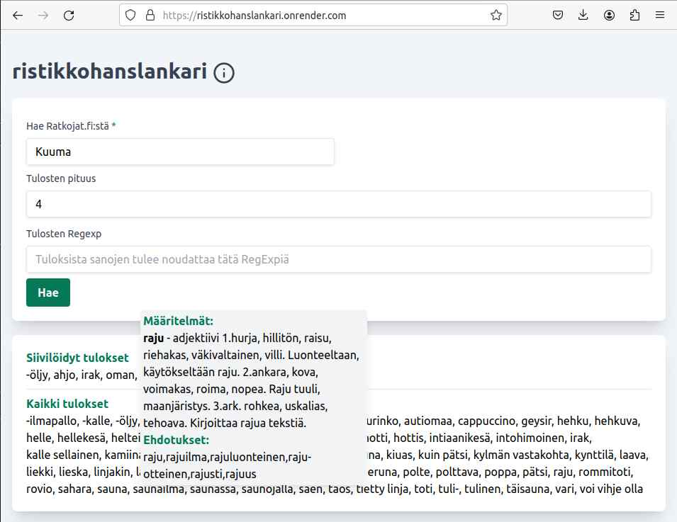

# Ristikkohanslankari

✨ I suck at crossword puzzles ✨ and existing tooling for Finnish crossword puzzles needed bit improving so here we are

## Amazing features

- Ability to find solutions from Ratkojat.fi based on given hints
- Ability to filter said results based on length or regexp
- Ability to define found words using kielitoimistonsanakirja.fi

Currently deployed to render.com https://ristikkohanslankari.onrender.com/ using free-potato-tier. So if you're trying to use the app beware that the app cold starts and it takes a while.

## Utilized datasources

This app uses webscraping as a datasource:

- https://www.Ratkojat.fi: For crossword puzzle solutions. Scraped using x-ray (this should probably be changed to some better package).
- https://www.kielitoimistonsanakirja.fi: For word definitions. Scraped using puppeteer as the site is SPA.

## Improvements

- Localizations (tho really no point as this app is for Finnish crossword puzzles)
- Proper error handling in BE and FE
- Proper logging in FE and BE
- Proper deployment pipeline (at the moment deployed through master-pipeline in render.com)
- Proper Dockerized local development
- Proper management of env variables
- Prevent tooltip texts from going offscreen properly
- Test but who needs those

## Development

### Client

1. Create .env-file from .env-example. Fill out server URL (server port is currently hardcoded (can't be bothered to change :-D) to use port 3000 so the value is probably `http://localhost:3000` for you too)
2. Navigate to `client`
3. Install dependencies `npm i`
4. Start dev server `npm run dev`

### Server

1. Navigate to `server`
2. Install dependencies `npm i`
3. Start dev server `npm run dev`
